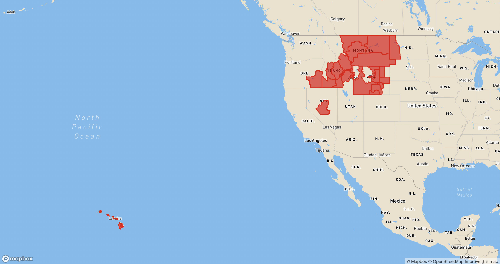

# mbx-devour
This is a basic mapbox map hosted at [caseymm.github.io/mbx-devour](caseymm.github.io/mbx-devour). The map is set up to display geojson passed to it through the url search parameters.

### URL Search Parameters
- `url` (geojson must be hosted somewhere, you cannot pass in raw geojson, e.g. https://weather-warnings.s3.us-west-1.amazonaws.com/rfw/latest.json)
- `fill` (do not include #, e.g. ff0080)
- `fill opacity` (e.g. .5)

An example url would be built like this: 
`https://caseymm.github.io/mbx-devour/?url=[your url]&fill=[your color]&fill-opacity=[your opacity]`

e.g. 
https://caseymm.github.io/mbx-devour/?url=https://weather-warnings.s3.us-west-1.amazonaws.com/rfw/latest.json&fill=e60000&fill-opacity=.6

That example would render this on the map:

### Locally
- build: `npm run build`
- add, commit, push
- deploy: `npm run deploy`

